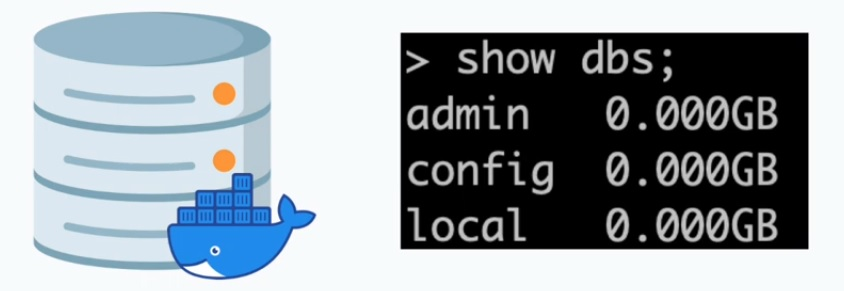
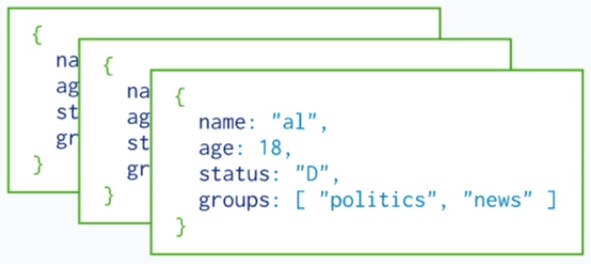
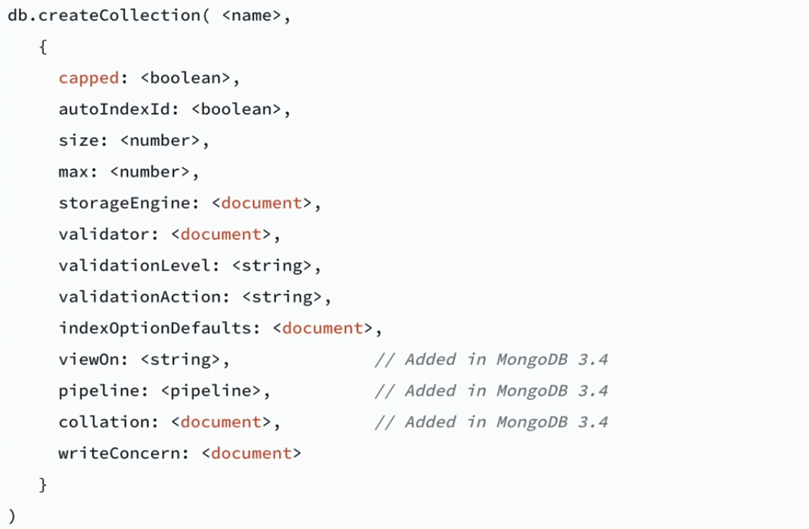
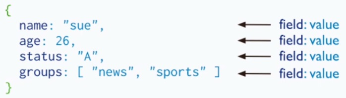
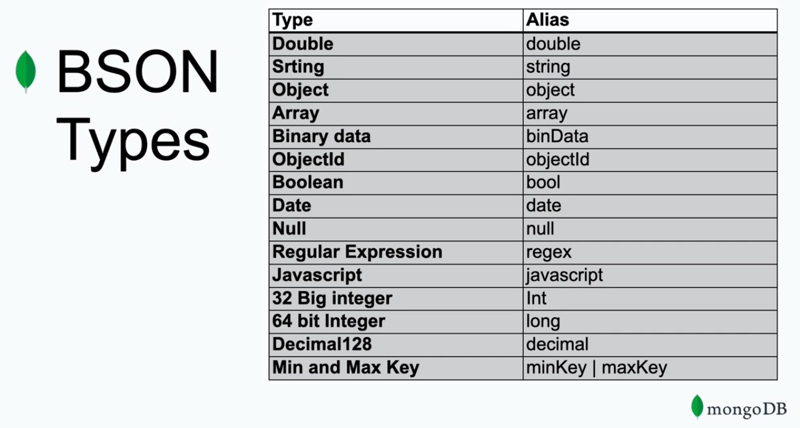
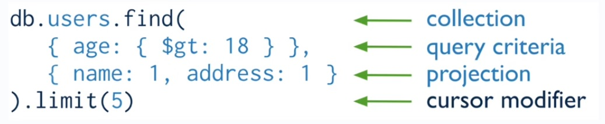

# MongoDB Basics

## Installation

- Directly from mongodb website f
	+ **Install on Linux**
	
		Install MongoDB Community Edition and required dependencies on Linux

	+ **Install on MacOS**
		
		Install MongoDB Community Edition on MacOS systems from MongoDB archives

	+ **Install on Windows**
		
		Install MongoDB Community Edition on Windows systems and optionally start MongoDB as a Windows

- Docker
	
	https://www.docker.com/get-started

## MongoDB and MongoExpress


## Docker Compose

```shell
$ docker --version
```

> configuration `docker-compose.yaml`

```yaml
version: "3.8"
services:
	mongodb:
		image: mongo
		container_name: mongodb
		ports:
			- 27017:27017
		volumes:
			- data:/data
		environment:
			- MONGO_INITDB_ROOT_USERNAME=rootuser
			- MONGO_INITDB_ROOT_PASSWORD=rootpass

	mongo-express:
		image: mongo-express
		container_name: mongo-express
		restart: always
		ports:
			- 8081:8081
		environment:
			- ME_CONFIG_MNOGODB_ADMINUSERNAME=rootuser
			- ME_CONFIG_MONGODB_ADMINPASSWORD=rootpass
			- ME_CONFIG_MONGODB_SERVER=mongodb

volumes:
	data: {}

networks:
	default:
		name: mongodb_network
```

> setup docker

```shell
$ docker-compose -f docker-compose.yaml up
// or
$ docker compose up
```

> stop docker

```shell
$ docker composer stop
```

> start docker

```shell
$ docker composer start
```

> show container

```shell
$ docker ps
```

> open mongo express http://localhost:8081/


## Connect to DB

- Using GUI Client (MongoExpress, DataGrip, MongoDB Compass)
- Mongo Shell

	+ `mongo mongodb://localhost:27017 -u rootuser -p rootpass`
	
> open docker shell container

```shell
$ docker exec -it <CONTAINER ID> bash
```

> connect mongodb shell

```shell
$ mongo mongodb://localhost:27017 -u rootuser -p rootpass
```

> show database

```shell
> show dbs;
```

## Mongo Shell

- Interactive JavaScript interface to MongoDB. Used to run commands against the database. For Example

	+ `mongo mongodb://localhost:27017 -u rootuser -p rootpass`
	+ `db.collection.insertOne({...})`

## Create Database



> use command to create or switch to db id exists

```shell
> show dbs
> use amigoscode
> show dbs
```

> create collection

```shell
> db.getName()
> db.createCollection("hello")
> show dbs
```

> drop database

```shell
< db.dropDatabase()
```

> show help

```shell
< db.help()
```

## Collections

- Mongo store documents (rows) in collections (table)



> create collection

```shell
> db.createCollection("person")
> show collections
```

> create collection with configuration



```shell
> db.createCollection("person", { capped: true, size: 61428, max: 30000 })
```

> show stats collection

```shell
> db.person.stats()
```

> drop collections

```shell
> db.person.drop()
> show collections
```

## Documents

- MongoDB stores data records as BSON documents. **BSON** is a binary representation of [JSON]() documents





> student.js

```js
student = {
	"firstName": "Retha",
	"lastName": "Killeen",
	"email": "rkilleen@mysql.com",
	"gender": "F",
	"country": "Philippines",
	"isStudentActive": false,
	"favouriteSubjects": [
		"maths",
		"english",
		"it"
	],
	"totalSpentInBooks": 0.0
}
```

> create collection

```shell
> show collections
> db.createCollection("student")
> show collections
```

> insert document

```shell
> db.student.insert(student)
> db.student.count()
```

> find document

```shell
> db.student.find()
```

> pritty document

```shell
> db.student.find().pretty()
```


## Insert Documents

> students.js

```js
students = [
	{
		"firstName": "Retha",
		"lastName": "Killeen",
		"email": "rkilleen@mysql.com",
		"gender": "F",
		"country": "Philippines",
		"isStudentActive": false,
		"favouriteSubjects": [
			"maths",
			"english",
			"it"
		],
		"totalSpentInBooks": 0.0
	},
	{
		"firstName": "Monica",
		"lastName": "Muguel",
		"email": "monicamiguel@mysql.com",
		"gender": "F",
		"country": "Singapore",
		"isStudentActive": false,
		"favouriteSubjects": [
			"maths",
			"english",
			"it"
		],
		"totalSpentInBooks": 6.0
	}
]
```


> insert many `db.student.insertMany([{...}, ...])`

```shell
db.student.insertMany(students)
```

> insert one `db.student.insert({...})`

```shell
db.student.insert(student)
```

## Using Find



> find collection

```shell
> db.student.find({}).pretty()
```

> find with query

```shell
> db.student.find({ firstName: 'Monica' }).pretty()
```

> find with projection

```shell
> db.student.find({ firstName: 'Monica'}, { firstName: 1 }).pretty()
> db.student.find({ firstName: 'Monica'}, { firstName: 1, lastName: 1, gender: 1 }).pretty()
```

```shell
> db.student.find({ firstName: 'Monica'}, { firstName: 0, lastName: 0, gender: 0 }).pretty()
```

## Update Documents

> set

```shell
> db.student.update({ _id: ObjectId("<id>")}, { $set: { firstName: "Maria" }})
```

> unset

```shell
> db.student.update({ _id: ObjectId("<id>")}, { $unset: { lastName: 1 }})
```

> increment

```shell
> db.student.update({ _id: ObjectId("<id>")}, { $inc: { totalSpentInBooks: 999 }})
```

> pull

```shell
> db.student.update({ _id: ObjectId("<id>")}, { $pull: { favouriteSubjects: 'it' }})
```

> push

```shell
> db.student.update({ _id: ObjectId("<id>")}, { $push: { favouriteSubjects: 'computer science' }})
```

## Delete Documents

> Delete

```shell
> db.student.find({}, {_id: 1}).pritty()
```

```shell
> db.student.deleteOne({ _id: ObjectId("<id>")})
```

```shell
> db.student.deleteOne({})
```

> Delete Many

```shell
> db.student.deleteMany({ gender: 'M' })
```

```shell
> db.student.deleteMany({})
```

## Next Steps